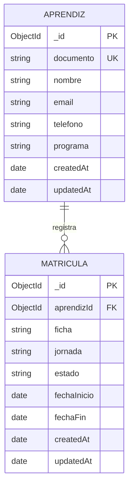

# Diagrama Entidad Relacion

```mermaid
erDiagram
  APRENDIZ ||--o{ MATRICULA : registra

  APRENDIZ {
    ObjectId _id PK
    string documento UK
    string nombre
    string email
    string telefono
    string programa
    date createdAt
    date updatedAt
  }

  MATRICULA {
    ObjectId _id PK
    ObjectId aprendizId FK
    string ficha
    string jornada
    string estado
    date fechaInicio
    date fechaFin
    date createdAt
    date updatedAt
  }
```
