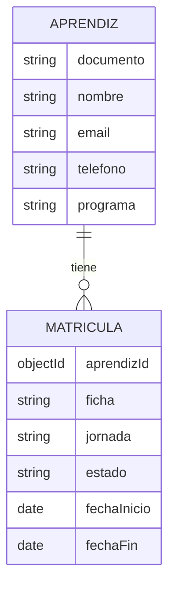

# Modelo Conceptual

El sistema administra dos conceptos principales:

- Aprendiz: persona registrada en el sistema academico.
- Matricula: registro que vincula un aprendiz con una ficha, jornada, estado y periodo de formacion.

Relacion:

- Un aprendiz puede tener una o muchas matriculas.
- Cada matricula pertenece a un unico aprendiz.

